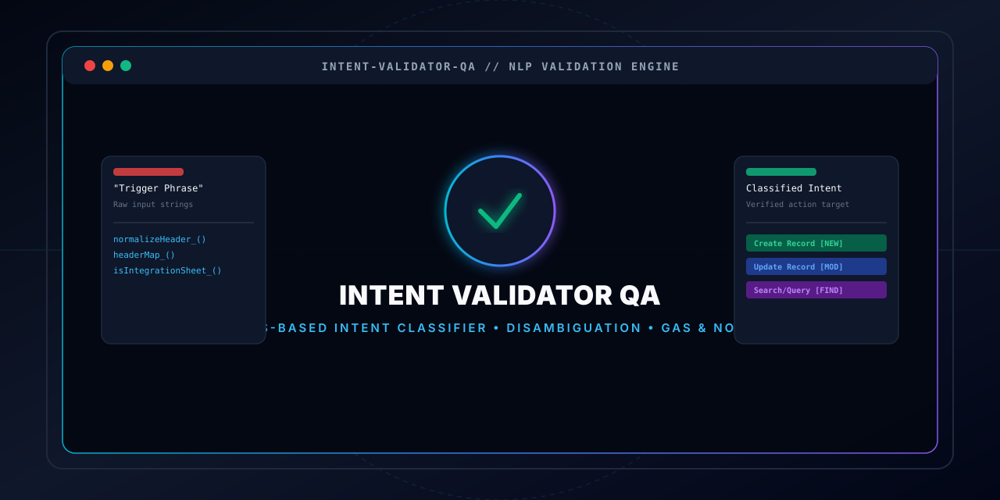
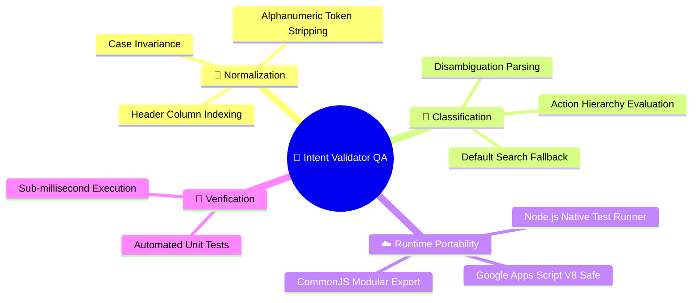
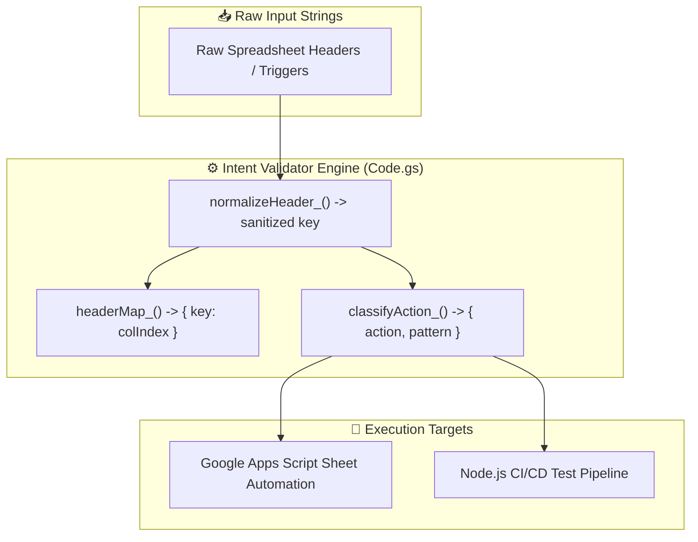

<!-- 🔬 INTENT VALIDATOR QA — REPOSITORY PRESENTATION (L3 SHOWCASE) -->

<div align="center">



# **🔬 Intent Validator QA**

**A high-precision, rules-based intent classification, utterance validation, and header disambiguation engine for Google Apps Script and Node.js.**

[](#-classification-rules)
[](package.json)
[-brightgreen?style=flat-square)](tests/)
[](#-how-it-works)
[](LICENSE)
[](https://github.com/traikdude/intent-validator-qa)

<p align="center">
  <a href="#-overview"><b>Overview</b></a> •
  <a href="#-core-features"><b>Features</b></a> •
  <a href="#-classification-rules"><b>Rules & Intent Logic</b></a> •
  <a href="#-test-suite"><b>Testing</b></a> •
  <a href="#-architecture"><b>Architecture</b></a> •
  <a href="#-quick-start"><b>Quick Start</b></a> •
  <a href="#-contributing"><b>Contributing</b></a> •
  <a href="#-license"><b>License</b></a>
</p>

</div>

---

## 📑 Table of Contents

- [✨ Overview](#-overview)
- [🚀 Core Features](#-core-features)
  - [1. Deterministic NLP Header Normalization](#1-deterministic-nlp-header-normalization)
  - [2. Multi-Action Intent Classification & Disambiguation](#2-multi-action-intent-classification--disambiguation)
  - [3. Google Apps Script & Node.js Dual Compatibility](#3-google-apps-script--nodejs-dual-compatibility)
  - [4. Automated QA Verification Suite](#4-automated-qa-verification-suite)
- [🧠 Classification Rules & Intent Logic](#-classification-rules--intent-logic)
- [🧪 Test Suite & Quality Assurance](#-test-suite--quality-assurance)
- [🏗️ Architecture & Component Flow](#-architecture--component-flow)
- [🛠️ Tech Stack](#-tech-stack)
- [⚡ Quick Start & Verification](#-quick-start--verification)
- [🗂️ Repository Structure](#-repository-structure)
- [🤝 Contributing](#-contributing)
- [📄 License](#-license)

---

## ✨ Overview

**Intent Validator QA** is a lightweight, zero-dependency rules-based natural language classification and disambiguation engine.

Designed for automated workflows, Google Sheets data ingestion, and bot utterance routing, the library cleans and normalizes variable spreadsheet headers, parses trigger phrases, disambiguates user intents across conflicting action categories, and executes deterministic rule-matching with zero AI hallucination risk.

---

## 🚀 Core Features



### 1. Deterministic NLP Header Normalization
Strips whitespace, punctuation, and non-alphanumeric noise using `normalizeHeader_()` to ensure bulletproof header-to-column indexing across dynamic spreadsheets.

### 2. Multi-Action Intent Classification & Disambiguation
Evaluates candidate phrases against prioritized action buckets (`actions_order`: Create Record, Update Record, Search/Query) using substring pattern matching.

### 3. Google Apps Script & Node.js Dual Compatibility
Written to run natively in Google Apps Script without bundlers while providing CommonJS module exports for CI/CD test automation.

### 4. Automated QA Verification Suite
Built-in regression tests utilizing Node's native test runner (`node:test`) to guarantee classification accuracy on every commit.

---

## 🧠 Classification Rules & Intent Logic

| Action Intent | Priority Order | Target Keywords / Patterns | Fallback Action |
|---|:---:|---|:---:|
| ➕ **Create Record** | 1 | `"new"`, `"add"`, `"create"`, `"insert"` | — |
| 🔄 **Update Record** | 2 | `"change"`, `"update"`, `"modify"`, `"edit"` | — |
| 🔍 **Search/Query** | 3 | `"find"`, `"search"`, `"get"`, `"lookup"` | Default Fallback |

---

## 🧪 Test Suite & Quality Assurance

Run the automated test runner locally:

```bash
npm test
```

### Test Output Verification
```text
▶ Intent Validator Logic
  ▶ normalizeHeader_
    ✔ should lowercase and strip non-alphanumeric characters
    ✔ should match Python NLP style normalization
  ▶ classifyAction_
    ✔ should classify "create" as Create Record
    ✔ should classify "update" as Update Record
    ✔ should prioritize recommended phrase if present
    ✔ should fallback to Search/Query default
  ▶ headerMap_
    ✔ should map headers to column indices
    ✔ should ignore empty headers
✔ Intent Validator Logic (8 tests passed, 0 failures)
```

---

## 🏗️ Architecture & Component Flow



---

## 🛠️ Tech Stack

* **Core Engine**: Google Apps Script JavaScript V8 (`Code.gs`)
* **Test Runner**: Node.js Native Test Framework (`node:test`, `assert`)
* **Package Management**: npm (`package.json`)
* **CI/CD Automation**: GitHub Actions

---

## ⚡ Quick Start & Verification

### Prerequisites
* [Node.js](https://nodejs.org/) (v18+)

### Setup & Run
1. Clone the repository:
   ```bash
   git clone https://github.com/traikdude/intent-validator-qa.git
   cd intent-validator-qa
   ```
2. Run test verification:
   ```bash
   npm test
   ```

---

## 🗂️ Repository Structure

```text
intent-validator-qa/
├── docs/                        # Presentation & visual assets
│   └── assets/
│       └── banner.svg           # L3 Showcase high-resolution vector hero banner
├── tests/
│   └── logic.test.js            # Node.js automated test runner & test cases
├── Code.gs                      # Core classification & normalization engine
├── package.json                 # Project test scripts & metadata
├── README.md                    # L3 Showcase presentation documentation
└── LICENSE                      # MIT Open Source License
```

---

## 🤝 Contributing

1. Fork the repository and create your feature branch (`git checkout -b feature/new-classification-rule`).
2. Add new test cases in `tests/logic.test.js` and implement logic in `Code.gs`.
3. Verify all tests pass: `npm test`.
4. Submit a Pull Request.

---

## 📄 License

Distributed under the **MIT License**. See [LICENSE](LICENSE) for details.

---

<div align="center">

*Engineered for Deterministic NLP, Data Quality & Automated QA.*  
**Intent Validator QA · Google Apps Script · Node.js**

</div>
